---

### 👨‍💻 About Me

CS student, finishing my BSc. I like software best once it's deployed and works the way its intended. Most of what I build runs on my own server, so I also own the CI, the backups and the debugging.

- 🔭 Building **[Pocketbook](https://github.com/traejiik/pocketbook)** — a self-hosted personal finance app with local-LLM spending insights, in daily use
- 🖥️ Running a **homelab** — five Docker stacks behind a reverse proxy, with CI-built images, backups and monitoring
- 💼 Web Development Intern at **Limelight**; previously a year on **EstiMate** at Beedesigned Studio
- 🌱 Currently levelling up in **backend fundamentals** — SQL beneath the ORM, and system design
- 📫 Open to **software engineering internships** in Hungary and across Europe
- 🌐 Check out my **[Portfolio](https://anotidamunemo.dev)**

---

### 🛠️ Tech Stack

---

### 📊 GitHub Stats

<table align="center">
  <tr>
    <td valign="top">
      
      
      
    </td>
    <td valign="top">
      
      
    </td>
  </tr>
</table>

---

### 🚀 Projects

  

---

### 🐍 Contribution Snake

  

---

### 🌐 Connect with Me

